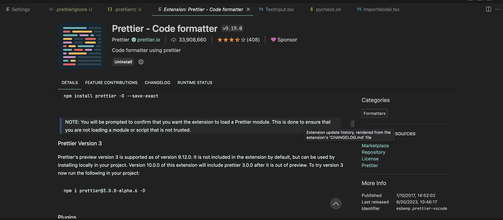
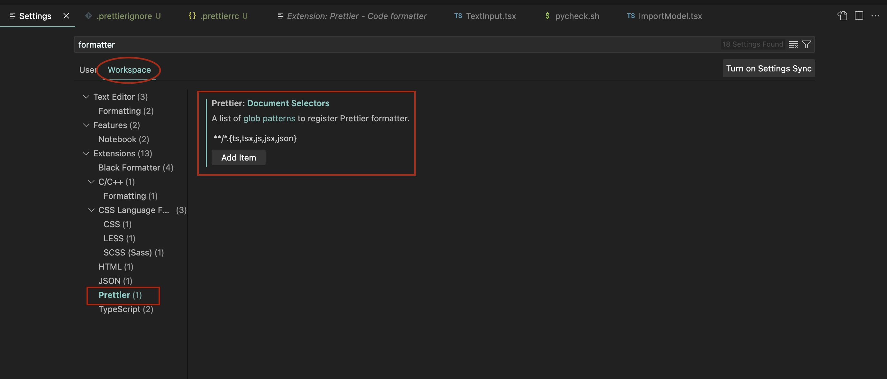

# intrinsic-model-server

> Speedy access to local LLMs ⚡️

> Checkout a demo of the server's main functionality below:

<iframe width="560" height="315" src="https://www.youtube.com/embed/6hm1sYKcrIo" title="YouTube video player" frameborder="0" allow="accelerometer; autoplay; clipboard-write; encrypted-media; gyroscope; picture-in-picture; web-share" allowfullscreen></iframe>

intrinsic-model-server is a fast and easy way to get started using the power of LLM models. It prefers to stay lean, and provides only the bare minimum of features including

- OpenAPI endpoints for serving your local LLMs to build apps to your liking
- A lightweight frontend for browsing and interacting with your local models

Our goal is to be a place for hackers, hobbyists and developers to easily catalog and use their models across hardware platforms behind a single API.

# Installation

If you'd like to run from source, see the [Developer Documentation](/#developer-documentation) section below.

We also distribute Docker images, hosted on [GitHub Packages](https://github.com/IntrinsicLabsAI/intrinsic-model-server/pkgs/container/intrinsic-model-server). To get started you can simply run

```
$ docker run -it -p 8000:8000 ghcr.io/intrinsiclabsai/intrinsic-model-server:latest

Unable to find image 'ghcr.io/intrinsiclabsai/intrinsic-model-server:latest' locally
latest: Pulling from intrinsiclabsai/intrinsic-model-server
92ad47755700: Pull complete
26fdba5dcbb4: Pull complete
8c0a87ac9995: Pull complete
6bc04cbfbbaa: Pull complete
7371c9b78edc: Pull complete
8ca60ac7dd55: Pull complete
2718b3f45548: Pull complete
d66bf3ddbb06: Pull complete
4f4fb700ef54: Pull complete
b96fb6eb3048: Pull complete
7d9d1ada1911: Pull complete
45c9d3a60ed7: Pull complete
c1e75fdc29b2: Pull complete
cdb0a3bc9f3e: Pull complete
Digest: sha256:0c45924e4f4f12f62309428c66f50e4a228be5ed431bc74b6a11073270c0db4d
Status: Downloaded newer image for ghcr.io/intrinsiclabsai/intrinsic-model-server:latest
INFO:     Started server process [1]
INFO:     Waiting for application startup.
INFO:     Application startup complete.
INFO:     Uvicorn running on http://0.0.0.0:8000 (Press CTRL+C to quit)
```

From there you can visit the server at http://localhost:8000 or using the IP of the device on which you ran the command.

# Quickstart

Let's get started registering and using models! We're going to walk you through how to use a large language model from [HuggingFace](https://huggingface.co/) Model Hub to get started.

We'll be using the [Vicuna7B quanitized model](https://huggingface.co/vicuna/ggml-vicuna-7b-1.1/blob/main/ggml-vic7b-q5_0.bin). This is a model trained by UC Berkeley and instruction-tuned so that it is more aligned to question-answering interactions similar to ChatGPT.

There are two ways to register a model with the server. Thanks to the magic of FastAPI, we have an easy to use OpenAPI that you can import into your favorite client like Postman, or use the included Swagger runnable API docs at http://localhost:8000/docs for a web-based client to run this example.

### Import a model via the API

The server provides an OpenAPI endpoint for importing new models. Importing a model allows you to provide a link to a remotely managed HuggingFace model file, or a path to a file on the local filesystem.

```shell
curl -X 'POST' 'http://localhost:8000/v1/imports' \
  -H 'Content-Type: application/json' \
  -d '{
  "type": "locatorv1/hf",
  "repo": "vicuna/ggml-vicuna-7b-1.1",
  "file": "ggml-vic7b-q5_0.bin"
}'
```

```json
"6ab01cbf-c5c5-4f2f-974a-d163a207bd2c"
```

You should receive a 200 OK response, with a body containing the UUID of a new import job.

You can poll the Import Job Status endpoint for the success/error result of the import:

```
curl 'http://localhost:8000/v1/imports/6ab01cbf-c5c5-4f2f-974a-d163a207bd2c'
```

```json
{
  "type": "finished",
  "info": "Successfully registered ggml-vicuna-7b-1.1__ggml-vic7b-q5_0.bin",
  "metadata": {
    "model_name": "ggml-vicuna-7b-1.1__ggml-vic7b-q5_0.bin",
    "model_id": "646f3b1b-f81e-4d38-a87f-a15a58ed19d6",
    "version": "0.1.0"
  }
}
```

We can see the full set of model information that was extracted via the import process:

```shell
curl localhost:8000/v1/models
```

```json
{
  "models": [
    {
      "id": "646f3b1b-f81e-4d38-a87f-a15a58ed19d6",
      "name": "ggml-vicuna-7b-1.1__ggml-vic7b-q5_0.bin",
      "model_type": "completion",
      "runtime": "ggml",
      "versions": [
        {
          "version": "0.1.0",
          "import_metadata": {
            "imported_at": "2023-06-30T18:18:26.686689",
            "source": {
              "type": "importv1/hf",
              "source": {
                "type": "locatorv1/hf",
                "repo": "vicuna/ggml-vicuna-7b-1.1",
                "file": "ggml-vic7b-q5_0.bin",
                "revision": "8ea1e83a4f96d60802c2f155036859bb9fbd5349"
              }
            }
          }
        }
      ]
    }
  ]
}
```

## Running Inference

Now you can use the model to run inference:

```shell
curl -XPOST localhost:8000/v1/models/ggml-vicuna-7b-1.1__ggml-vic7b-q5_0.bin/versions/0.1.0/complete \
      -H 'Content-Type: application/json' \
      -d '{
            "prompt": "This is what a pirate would say at the DMV:",
            "tokens": 128,
            "temperature": 0.3
          }'
```

```json
{
  "model_name": "ggml-vicuna-7b-1.1__ggml-vic7b-q5_0.bin",
  "model_version": "0.1.0",
  "elapsed_seconds": 5.513493061065674,
  "completion": "\"Ahoy, matey! I be here to renew me driver's license and take the test if need be. But don't ye worry about that, I be a seasoned sailor when it comes to these land-based tasks. Just show me where to sign and I'll be on my way.\""
}
```

# Developer documentation

> We ❤️ contributions!

## Tooling

`intrinsic-model-server` requires Python 3.11 or newer. We recommend using [pyenv](https://github.com/pyenv/pyenv) to manage Python versions but use whatever you like.

You'll also need to be on a system that has `gcc` installed so you can build the native `llama-cpp-python` wheel.

- on macOS, you do this by installing XCode Developer Tools on your machine. Run `xcode-select --install` and follow the prompts
- on Linux follow the guide for your distribution, e.g. on Ubuntu you would run `apt install build-essential`. See `Dockerfile` in the root of this repo for an example of how to setup a Linux environment to build the project.

Clone the project:

```bash
git clone git@github.com:IntrinsicLabsAI/intrinsic-model-server.git
```

## Python development

### Project setup

Create the virtual environment and rehydrate the dependencies from the requirements file:

```bash
python -m venv ./venv
./venv/bin/pip install -r requirements.txt
```

You should now be able to startup the server

```bash
$ ./venv/bin/uvicorn modelserver.app:app --host 0.0.0.0 --port 8000
INFO:     Started server process [38742]
INFO:     Waiting for application startup.
INFO:     Application startup complete.
INFO:     Uvicorn running on http://0.0.0.0:8000 (Press CTRL+C to quit)
```

### Tests and lints

Tests currently live in the `test_app.py` file. We use the `pytest` framework, which dictates all tests must be in a function matching `test_*`.

For linting we use a combination of [isort](https://pycqa.github.io/isort/) (for import statements), [black](https://github.com/psf/black) (for general formatting) and [mypyp](https://mypy-lang.org/) (for type checking). These are all run with relevant strict flags at CI preventing potentially unsafe or poorly formatted code from making it into mainline.

You can and are encouraged to run the full set of tests and and lints yourself, it should complete in 2-3 seconds:

```
./scripts/pycheck.sh
```

## App development

The app is based on [React](https://react.dev/) and [TypeScript](https://www.typescriptlang.org/), industry-standard tools that came out of decades of learning how to build reliable applications for the Modern Web. We also use [Vite](https://vitejs.dev/) as bundler and dev server.

The app is kept in the `frontend` subproject.

```bash
cd frontend

# Install dependencies and update `package-lock.json`, run this after every pull
npm run i

# run linting and testing
npm run lint

# run the live dev server
npm run dev
```

### VSCode Setup

It's recommended that you use Visual Studio Code for developing as it has a great set of plugins for TypeScript projects.

1. Install the [Prettier Plugin](<[Title](https://marketplace.visualstudio.com/items?itemName%253Desbenp.prettier-vscode)>) and be sure that it's enabled in your Workspace



2. In Settings -> Workspace, be sure to configure `Prettier: Document Selectors` to pick up all TypeScript, JS and JSON files with the glob pattern `**/*{ts,tsx,js,jsx, json}`



You can similarly accomplish this by directly editing `.vscode/settings.json`:

```json
{
  "prettier.documentSelectors": "**/*{ts,tsx,js,jsx, json}"
}
```

Ensure that `Format On Save` is enabled in the workspace, e.g. by adding the following to `settings.json`

```json
{
  "prettier.documentSelectors": "**/*{ts,tsx,js,jsx, json}",
  "editor.formatOnSave": true
}
```

Prettier checks are built into the linting process, so running

```shell
$ cd frontend
$ npm run lint
```

Will scan for eslint errors as well prettier formatting. If you'd like to manually trigger formatting of all files in the frontend repo, run

```shell
$ cd frontend
$ npx prettier --write .
```
